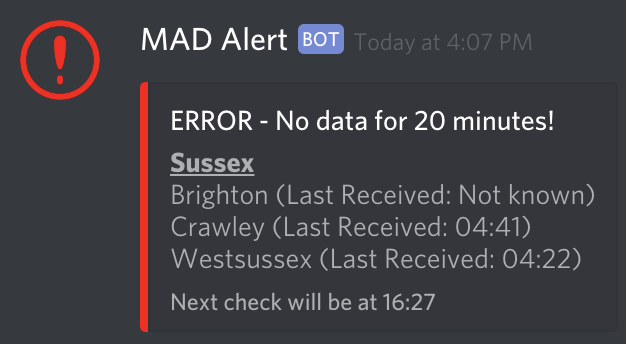

# MADevice

[](https://www.python.org/downloads/release/python-370/)

Provides a way to monitor devices being used in MAD without needing a browser. Get alerts in Discord when they have not updated for a set amount of time. As well as a way to get the status of your devices on demand without leaving Discord.
git 
## Requirements
* Python 3.7 (Only tested on 3.7, other Python 3 versions may work)

> WHERE IT SAYS `python[3[.7]]` or  `pip[3[.7]]` DON'T JUST COPY AND PASTE. EITHER RUN:
> * `pip` if you only have python 3 installed
> * `pip3` if you only have one python 3 installed
> * `pip3.7` if you have multiple python 3 installs.

## Setup
* Clone this repo
* You **MUST** create a virtual environment as this and MAD use different websocket versions.
   * Go to the folder containing MADevice. Within this folder run `python[3[.7]] -m venv py3`. This will create a folder within called `py3`
   * Within this there is a `bin` folder and in this there is the pip and python installs for this envrionment.
* Once you have a venv run from in the MADevice folder `<PATH_TO_VENV_BIN>/pip[3[.7]] install -r requirements.txt`
* Ensure you have entered your server details and name into `servers.json` (take a copy from `servers.json.example`)
    * This should be the `IP` and the `port`.
    * If you have set authentication for MADmin, ensure you add `username` and `password` to each of the servers in `servers.json`
* Create `config.ini` from `config.ini.example` and populate the value which says `REQUIRED`
    * Optional config
        * `duration_before_alert` this is the number of minutes that MAD has not received any proto data for, before it raises an alert (Default: 20 minutes)
        * `delay_between_checks` this is the amount of time that MADevice does to sleep before checking the status of the devices again (Default: 20 minutes)

## Run

```
<PATH_TO_VENV_BIN>/python[3[.7]] main.py
```

### No Data Alert
When running it will check the last received time for data and then if it is more than 20 minutes (or the values set in `alert_recheck_time`) in the past it will post a message to the channel set by `webhook` in `servers.json`



### On-Demand Status (`!status`)

If you type `!status` in the channel set by `status_channel_id` in servers.json  You get an on-demand update across all servers (set in servers.json) and posted into Discord rather than opening up multiple browsers to see the data.


## FAQ

### - How to get `status_channel_id`?

Enable developer mode -> https://support.discordapp.com/hc/en-us/articles/206346498-Where-can-I-find-my-User-Server-Message-ID-

Then go to the channel you want the messages to be posted in. Right-click and select `Copy ID` and paste in `servers.json`

### - How to create Discord token?

https://github.com/reactiflux/discord-irc/wiki/Creating-a-discord-bot-&-getting-a-token

### -  How do I add my Discord token to my server?

https://www.techjunkie.com/add-bots-discord-server/

### - Why do i not get notifications for new alerts

If a server has over 2500 members this limits the notifications and you won't get a push notification. To resolve this create a role (assign the relevant users to this role) and add the role id to the corresponding server in servers.json - see the example json. 

> Make sure the role has "Allow anyone to @mention this role" enabled otherwise it wont trigger a notification

### - `Ctrl + C` does not stop MADevice
As of Python 3.6, the interpreter handles SIGINT generated by Ctrl+C differently for Linux and Windows.

See the below examples for how to stop the processes:
#### Mac OS and Linux

`Ctrl + Shift + \` or `Ctrl + \`

#### Windows

General: `Ctrl+Break`

Dell: `Ctrl+Fn+F6` or `Ctrl+Fn+S`

Lenovo: `Ctrl+Fn+F11` or `Ctrl+Fn+B`

HP: `Ctrl+Fn+Shift`

Samsung: `Fn+Esc`
